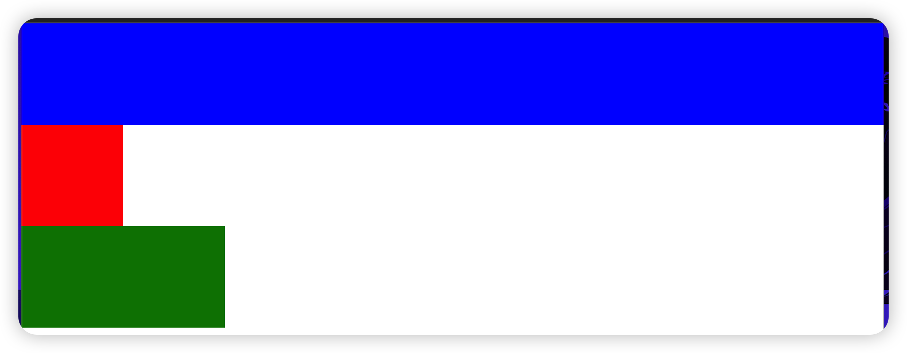
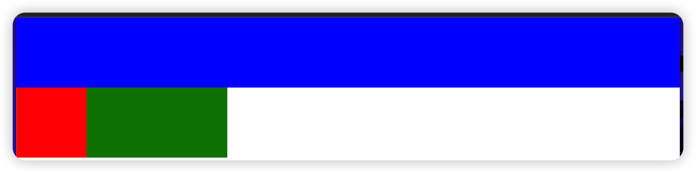
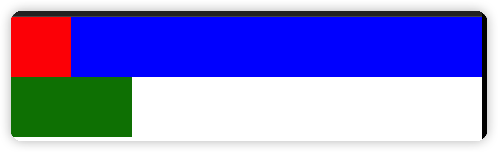
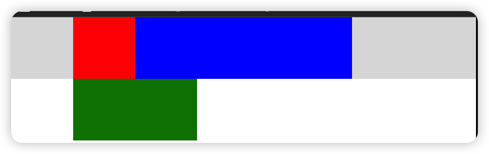
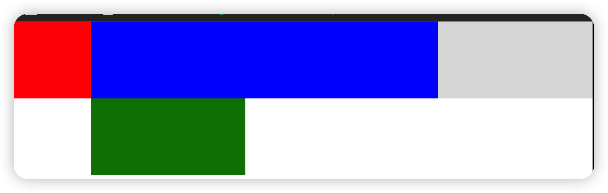
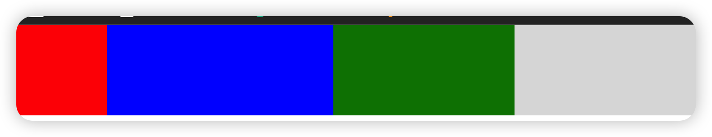
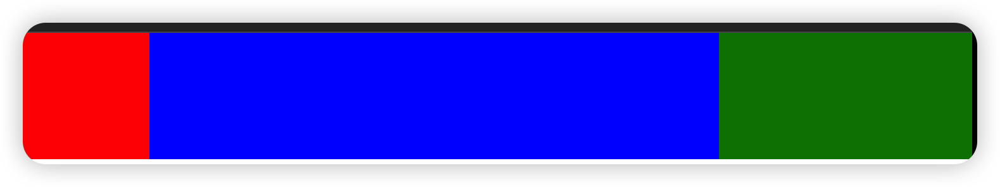
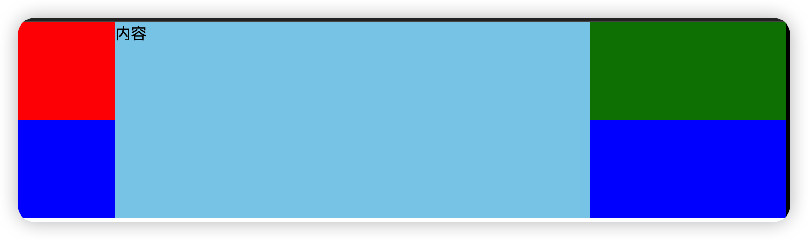

# 前言

圣杯布局和双飞翼布局作为前端面试高频题目，是我们找前端工作的程序员必须掌握的一个知识点，由于博主将来要准备秋招，最近在学习圣杯布局的过程中明显感觉到了一些不好理解的点，于是打算系统地学习 *圣杯布局*和*双飞翼布局*，并作出笔记，方便大家一起来学习交流～～

# 概念

首先，**圣杯布局**和**双飞翼布局**都是一个意思，都具有以下特点：

- 都是三栏布局，两侧盒子的宽度固定，中间盒子的宽度自适应。
- 中间盒子优先渲染*（也就是中间的`div`要放在最前面）*
- 双飞翼布局比圣杯布局多了一个额外的`<div>`标签

了解了主要特点后，我们再对这两种布局分别学习。

# 圣杯布局

首先我们给出圣杯布局的HTML结构

``````html
   <div class="container">
      <div class="middle"></div>
      <div class="left"></div>
      <div class="right"></div>
    </div>
``````

因为中间盒子需要优先渲染，`.middle`则写在最前面，又因为中间盒子的宽度需要自适应，则设置宽度为`100%`

现在给出每个盒子的样式

``````css
body {
        margin: 0;
      }

      .container {
        width: 100%;
        height: 100px;
      }

      .middle {
        width: 100%;
        height: 100px;
        background-color: blue;
      }

      .left {
        width: 100px;
        height: 100px;
        background-color: red;
      }

      .right {
        width: 200px;
        height: 100px;
        background-color: green;
      }
``````

则可以看到如下的效果：



因为是盒子模型，所以每个盒子会独占一行，为了让他们都在一行，于是都给这三个盒子添加 `float:left`属性，使其脱离文档流，代码如下：

``````css
    body {
        margin: 0;
      }

      .container {
        width: 100%;
        height: 100px;
      }

      .middle {
        width: 100%;
        height: 100px;
        background-color: blue;
        float:left
      }

      .left {
        width: 100px;
        height: 100px;
        background-color: red;
        float:left
      }

      .right {
        width: 200px;
        height: 100px;
        background-color: green;
        float:left
      }  
``````

效果如下：



从上面可以看出，左右盒子都到了同一行，而中间蓝色盒子因为宽度撑满了页面`width:100%`，于是其单独一行，现在我们的目标就是将***红色盒子放到蓝色盒子的左边，绿色盒子放到蓝色盒子的右边***。

首先我们先解决红色盒子的位置问题，在这里可以通过设置`margin-left:-100%`让红色盒子跑到蓝色盒子的左边，代码：

``````css
     body {
        margin: 0;
      }

      .container {
        width: 100%;
        height: 100px;
      }

      .middle {
        width: 100%;
        height: 100px;
        background-color: blue;
        float: left;
      }

      .left {
        width: 100px;
        height: 100px;
        background-color: red;
        float: left;
        margin-left: -100%;
      }

      .right {
        width: 200px;
        height: 100px;
        background-color: green;
        float: left;
      }
``````

效果如下：



此时可以看到红色盒子走到了蓝色盒子的左边，此时有的同学应该有疑惑，<font color="red">*为什么红色盒子设置了`margin-left`会跑到上面一行去，不应该继续往屏幕左边走吗？*</font>

这是因为我们将三个盒子都设置成了向左浮动`float:left`，虽然从视觉上看上去红色和绿色被蓝色撑到了第二行，但是实际上这三个盒子还是从左到右依次紧贴着的，感觉有点抽象哈～～，设置了负值的`margin-left`后，红色盒子就开始从蓝色盒子的右边开始向左移动，所以最后移动到了蓝色盒子的左边。

但是此时需要注意，因为红色向左移动了100%的宽度，现在的位置只是红色盒子的左边框和蓝色盒子的左边框重叠，实际上红色盒子还在蓝色盒子的里面，把蓝色盒子的左边一部分给覆盖了，所以我们还需要预留出红色盒子和绿色盒子的位置，我们就考虑到给父盒子`.container`使用`padding`属性，代码如下：

``````css
      body {
        margin: 0;
      }

      .container {
        width: 100%;
        height: 100px;
        background-color: #ddd;
        padding-left: 100px;
        padding-right: 200px;
        box-sizing: border-box;
      }

      .middle {
        width: 100%;
        height: 100px;
        background-color: blue;
        float: left;
      }

      .left {
        width: 100px;
        height: 100px;
        background-color: red;
        float: left;
        margin-left: -100%;
      }

      .right {
        width: 200px;
        height: 100px;
        background-color: green;
        float: left;
      }
``````

效果如下：



灰色部分则是通过`padding`预留的位置，现在还需要将红色盒子移动到左边灰色位置。因为我们已经使用过`margin-left:-100%`通过宽度百分比移动，如果继续通过`margin-left`属性来移动的话只能继续使用百分比，而左边部分是固定值，百分比是通过屏幕大小动态变化的，所以`margin-left`是无法再做到固定值移动，为了解决这个问题，我们可以使用相对定位`position:relative`来移动红色盒子，代码如下：

``````css
   .container {
        width: 100%;
        height: 100px;
        background-color: #ddd;
        padding-left: 100px;
        padding-right: 200px;
        box-sizing: border-box;
      }

      .middle {
        width: 100%;
        height: 100px;
        background-color: blue;
        float: left;
      }

      .left {
        width: 100px;
        height: 100px;
        background-color: red;
        float: left;
        margin-left: -100%;
        position: relative;
        left: -100px;           /* 通过left设置负值使其向左移动 */
      }

      .right {
        width: 200px;
        height: 100px;
        background-color: green;
        float: left;
      }
``````

于是有了以下的效果：



接下来就用同样的方式设置`margin-left: -200px`来移动绿色盒子。

``````css
    .container {
        width: 100%;
        height: 100px;
        background-color: #ddd;
        padding-left: 100px;
        padding-right: 200px;
        box-sizing: border-box;
      }

      .middle {
        width: 100%;
        height: 100px;
        background-color: blue;
        float: left;
      }

      .left {
        width: 100px;
        height: 100px;
        background-color: red;
        float: left;
        margin-left: -100%;
        position: relative;
        left: -100px;
      }

      .right {
        width: 200px;
        height: 100px;
        background-color: green;
        float: left;
        margin-left: -200px;
      }
``````

效果如下：



并且设置相对定位`position:relative`使其向右移动200px

``````css
      body {
        margin: 0;
      }

      .container {
        width: 100%;
        height: 100px;
        background-color: #ddd;
        padding-left: 100px;
        padding-right: 200px;
        box-sizing: border-box;
      }

      .middle {
        width: 100%;
        height: 100px;
        background-color: blue;
        float: left;
      }

      .left {
        width: 100px;
        height: 100px;
        background-color: red;
        float: left;
        margin-left: -100%;
        position: relative;
        left: -100px;
      }

      .right {
        width: 200px;
        height: 100px;
        background-color: green;
        float: left;
        margin-left: -200px;
        position: relative;
        right: -200px;
      }
``````

效果如下：



这样，整个圣杯布局的效果就完成啦～～其实初学时候比较难理解的也就是`margin-left:-100%`对于左浮动元素的影响，为了加深理解大家可以多敲敲代码看看效果。下面给出圣杯布局的整体代码：

``````html
<!DOCTYPE html>
<html lang="en">
  <head>
    <meta charset="UTF-8" />
    <meta http-equiv="X-UA-Compatible" content="IE=edge" />
    <meta name="viewport" content="width=device-width, initial-scale=1.0" />
    <title>圣杯布局的实现</title>
    <style>
      body {
        margin: 0;
      }

      .container {
        width: 100%;
        height: 100px;
        background-color: #ddd;
        padding-left: 100px;
        padding-right: 200px;
        box-sizing: border-box;
      }

      .middle {
        width: 100%;
        height: 100px;
        background-color: blue;
        float: left;
      }

      .left {
        width: 100px;
        height: 100px;
        background-color: red;
        float: left;
        margin-left: -100%;
        position: relative;
        left: -100px;
      }

      .right {
        width: 200px;
        height: 100px;
        background-color: green;
        float: left;
        margin-left: -200px;
        position: relative;
        right: -200px;
      }
    </style>
  </head>
  <body>
    <div class="container">
      <div class="middle"></div>
      <div class="left"></div>
      <div class="right"></div>
    </div>
  </body>
</html>

``````

# 双飞翼布局

双飞翼布局和圣杯布局的区别在于解决中间部分遮挡的方法不同。圣杯布局主要给父元素添加`padding`和给三个盒子设置`position:relative`相对定位来实现，而双飞翼布局不会这么复杂，只需要给中间盒子再添加一个放置内容的div就解决问题了～～

代码如下：

``````css
<!DOCTYPE html>
<html lang="en">
  <head>
    <meta charset="UTF-8" />
    <meta http-equiv="X-UA-Compatible" content="IE=edge" />
    <meta name="viewport" content="width=device-width, initial-scale=1.0" />
    <title>双飞翼布局的实现</title>
    <style>
      body {
        margin: 0;
      }

      .container {
        width: 100%;
        height: 200px;
        background-color: #ddd;
      }

      .middle {
        width: 100%;
        height: 200px;
        background-color: blue;
        float: left;
      }

      .left {
        width: 100px;
        height: 100px;
        background-color: red;
        float: left;
        margin-left: -100%;
      }

      .right {
        width: 200px;
        height: 100px;
        background-color: green;
        float: left;
        margin-left: -200px;
      }

      .content {
        margin-left: 100px;
        margin-right: 200px;
        background-color: skyblue;
        height: 100%;
      }
    </style>
  </head>
  <body>
    <div class="container">
      <div class="middle">
        <div class="content">内容</div>
      </div>
      <div class="left"></div>
      <div class="right"></div>
    </div>
  </body>
</html>
``````

效果如下：



从效果图可以看出，红色盒子和绿色盒子遮挡住了蓝色盒子的左右部分，但是这次我们是将内容放到`.content`盒子里，并给天蓝色盒子设置了`margin-left和margin-right`属性，这样内容部分就不会被左右两边固定宽度的盒子遮挡，双飞翼布局也就实现啦～

如果还有不明白的同学可以添加博主vx一起交流讨论噢，希望该文章能帮助到大家，最后祝同学们面试顺利！


