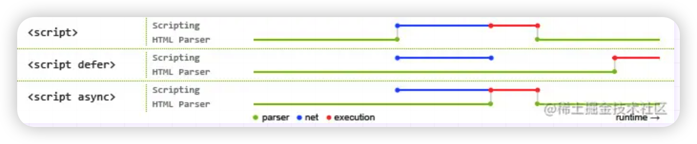

# 前言

本篇文章主要总结一些常见的HTML面试题,会不断更新。

# src和href的区别

- herf是*Hypertext Reference*的缩写，表示**超文本链接**，指向网络资源所在的位置，建立和当前元素或当前文档之间的链接，用于超链接，常用于`link`和`a`等元素上。

例如超链接：

``````html
<a href="www.mespace.fun">www.mespace.fun</a>
``````

或者链接到外部样式文件：

``````html
<link href="xx.css" rel="stylesheet" /> 
``````

- src是*source*的缩写，表示**资源引入**，指向的内容将会嵌入到文档中当前标签所在位置(也可以理解为将指向的内容替换当前元素)，在请求src资源时会将其指向的资源下载并应用到文档内，例如`javascript`脚本，`img`图片和`iframe`等元素。

  <font color="red">当浏览器解析到该元素时，会暂停其他资源的下载和处理，直到将该资源加载、编译、执行完毕，图片和框架等元素也如此，类似于将所指向资源嵌入当前标签内，*这也是为什么将js脚本放在底部而不是头部*</font>

例如引入js：

``````html
<script src="js.js"></script>
``````

或者用于图片标签:

``````html

``````

等等

***注意***：`src`和`href`不能相互替换，简单地说，在可替换的元素上使用`src`,然而把`href`用于在涉及的文档和外部资源之间建立一个关系。

# 对HTML语义化的理解

**语义化是指根据内容的结构化（内容语义化），选择合适的标签（代码语义化）**。简单来讲就是用正确的标签做正确的事情。

语义化的优点如下：

- 对机器友好，带有语义的文字表现力丰富，更适合搜索引擎的爬虫爬取有效信息，有利于SEO(搜索引擎优化)。除此之外，语义类还支持读屏软件，根据文章可以自动生成目录。
- 对开发者友好，使用语义类标签增强了可读性，结构更加清晰，开发者能清晰的看出网页的结构，便于团队的开发与维护。

常见的语义化标签：

``````html
<header></header>  头部

<nav></nav>  导航栏

<section></section>  区块（有语义化的div）

<main></main>  主要区域

<article></article>  主要内容

<aside></aside>  侧边栏

<footer></footer>  底部
``````

# script标签中defer和async的区别



蓝色代表js脚本网络加载时间，红色代表js脚本执行时间，绿色代表HTML解析。

**`defer`和`async`属性都是去异步加载外部的js脚本文件，它们都不会阻塞页面的解析，**其区别是：

- **执行顺序**：多个带`async`属性的标签，不能保证加载的顺序；多个带`defer`的标签，按照加载顺序执行。
- **脚本是否并行执行**：`async`属性，表示后续文档的加载与执行与js脚本的加载和执行是并行进行的，即异步执行；defer属性，加载后续文档的过程与js脚本的加载（此时仅加载不执行）是并行执行的（异步），js脚本需要等到文档文档所有元素解析完成之后才执行。

# HTML5有哪些更新

#### 语义化标签

- header：定义文档的页眉（头部）；
- nav：定义导航链接的部分；
- footer：定义文档或节的页脚（底部）；
- article：定义文章内容；
- section：定义文档中的节（section、区段）；
- aside：定义其所处内容之外的内容（侧边）；

#### 媒体标签

（1） audio：音频

```html
<audio src='' controls autoplay loop='true'></audio>
```

属性：

- controls 控制面板
- autoplay 自动播放
- loop=‘true’ 循环播放

（2）video：视频

```html
<video src='' poster='imgs/aa.jpg' controls></video>
```

属性：

- poster：指定视频还没有完全下载完毕，或者用户还没有点击播放前显示的封面。默认显示当前视频文件的第一针画面，当然通过poster也可以自己指定。
- controls 控制面板
- width
- height

（3）source标签 因为浏览器对视频格式支持程度不一样，为了能够兼容不同的浏览器，可以通过source来指定视频源。

```html
<video>
 	<source src='aa.flv' type='video/flv'></source>
 	<source src='aa.mp4' type='video/mp4'></source>
</video>
```

#### 表单

**表单类型**：

- email ：能够验证当前输入的邮箱地址是否合法

- url ： 验证URL

- number ： 只能输入数字，其他输入不了，而且自带上下增大减小箭头，max属性可以设置为最大值，min可以设置为最小值，value为默认值。

- search ： 输入框后面会给提供一个小叉，可以删除输入的内容，更加人性化。

- range ： 可以提供给一个范围，其中可以设置max和min以及value，其中value属性可以设置为默认值

- color ： 提供了一个颜色拾取器

- time ： 时分秒

- data ： 日期选择年月日

- datatime ： 时间和日期(目前只有Safari支持)

- datatime-local ：日期时间控件

- week ：周控件

- month：月控件

**表单属性：**

- placeholder ：提示信息
- autofocus ：自动获取焦点
- autocomplete=“on” 或者 autocomplete=“off” 使用这个属性需要有两个前提：
  - 表单必须提交过
  - 必须有name属性。
- required：要求输入框不能为空，必须有值才能够提交。
- pattern=" " 里面写入想要的正则模式，例如手机号patte="^(+86)?\d{10}$"
- multiple：可以选择多个文件或者多个邮箱
- form=" form表单的ID"

**表单事件：**

- oninput 每当input里的输入框内容发生变化都会触发此事件。
- oninvalid 当验证不通过时触发此事件。

#### 进度条、度量器

- progress标签：用来表示任务的进度（IE、Safari不支持），max用来表示任务的进度，value表示已完成多少
- meter属性：用来显示剩余容量或剩余库存（IE、Safari不支持）
  - high/low：规定被视作高/低的范围
  - max/min：规定最大/小值
  - value：规定当前度量值

设置规则：min < low < high < max

#### DOM查询操作

- document.querySelector()
- document.querySelectorAll()

它们选择的对象可以是标签，可以是类(需要加点)，可以是ID(需要加#)

#### Web存储

HTML5 提供了两种在客户端存储数据的新方法：

- localStorage - 没有时间限制的数据存储
- sessionStorage - 针对一个 session 的数据存储

#### 其他

- 拖放：拖放是一种常见的特性，即抓取对象以后拖到另一个位置。设置元素可拖放：

```html

复制代码
```

- 画布（canvas ）： canvas 元素使用 JavaScript 在网页上绘制图像。画布是一个矩形区域，可以控制其每一像素。canvas 拥有多种绘制路径、矩形、圆形、字符以及添加图像的方法。

```html
<canvas id="myCanvas" width="200" height="100"></canvas>
复制代码
```

- SVG：SVG 指可伸缩矢量图形，用于定义用于网络的基于矢量的图形，使用 XML 格式定义图形，图像在放大或改变尺寸的情况下其图形质量不会有损失，它是万维网联盟的标准
- 地理定位：Geolocation（地理定位）用于定位用户的位置。‘

**总结：** （1）新增语义化标签：nav、header、footer、aside、section、article （2）音频、视频标签：audio、video （3）数据存储：localStorage、sessionStorage （4）canvas（画布）、Geolocation（地理定位）、websocket（通信协议） （5）input标签新增属性：placeholder、autocomplete、autofocus、required （6）history API：go、forward、back、pushstate

**移除的元素有：**

- 纯表现的元素：basefont，big，center，font, s，strike，tt，u;
- 对可用性产生负面影响的元素：frame，frameset，noframes；

