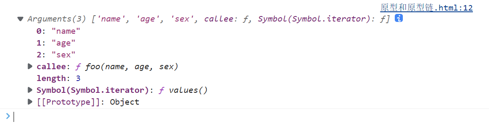

## 类数组对象

**类数组对象**：拥有一个length属性和若干索引属性的对象

举个例子：

```javascript
var array = ['name', 'age', 'sex'];

var arrayLike = {
    0: 'name',
    1: 'age',
    2: 'sex',
    length: 3
}
```

*为什么叫类数组对象呢*？

我们从读写、获取长度、遍历三个方面看看这两个对象。

## 读写

```javascript
console.log(array[0]);	   //name
console.log(arrayLike[0]); //name

array[0] = 'new name';
arrayLike[0] = 'new name';
```

## 长度

```javascript
console.log(array.length); // 3
console.log(arrayLike.length); // 3
```

## 遍历

```javascript
for(var i = 0, len = array.length; i < len; i++) {
    ....
}
for(var i = 0, len = arrayLike.length; i < len; i++) {
    ....
}
```

看起来就很像

那类数组对象可以使用数组的方法吗？比如：

```
arrayLike.push('4');
```

会报错：*arrayLike.push is not a function*

所以还是类数组..

## 调用数组方法

如果类数组就是想用数组的方法怎么办呢？

既然无法直接调用，我们可以用`Function.call`间接调用：

```javascript
var arrayLike = {0: 'name', 1: 'age', 2: 'sex', length: 3 }

Array.prototype.join.call(arrayLike, '&'); // name&age&sex

Array.prototype.slice.call(arrayLike, 0); // ["name", "age", "sex"] 
// slice可以做到类数组转数组

Array.prototype.map.call(arrayLike, function(item){
    return item.toUpperCase();
}); 
// ["NAME", "AGE", "SEX"]
```

## 类数组转数组

在上面的例子中已经提到了一种类数组转数组的方法，再补充三个：

```javascript
var arrayLike = {0: 'name', 1: 'age', 2: 'sex', length: 3 }
// 1. slice
Array.prototype.slice.call(arrayLike); // ["name", "age", "sex"] 
// 2. splice
Array.prototype.splice.call(arrayLike, 0); // ["name", "age", "sex"] 
// 3. ES6 Array.from
Array.from(arrayLike); // ["name", "age", "sex"] 
// 4. apply
Array.prototype.concat.apply([], arrayLike)
```

那么为什么会讲到类数组对象呢？以及类数组有什么应用吗？

要说到类数组对象，`Arguments` 对象就是一个类数组对象。在客户端 JavaScript 中，一些 DOM 方法(`document.getElementsByTagName()`等)也返回类数组对象。

## Arguments对象

接下来重点学习Arguments对象。

Arguments对象只定义在函数体中，包括了函数的参数和其他属性。在函数体中，arguments指代该函数的Arguments对象

举个例子：

```javascript
function foo(name, age, sex){
    console.log(arguments);
}

foo('name', 'age', 'sex')
```

打印结果如下：

我们可以看到除了类数组的索引属性和`length`属性外，还有一个callee属性，接下来一个一个学习。

### length属性

Arguments对象的`length`属性，表示实参的长度，举个例子：

```javascript
function foo(b, c, d){
    console.log("实参的长度为：" + arguments.length)
}

console.log("形参的长度为：" + foo.length)

foo(1)

//形参的长度为：3
//实参的长度为：1
```

### callee属性

Arguments对象的`callee`属性，通过它可以调用函数自身。

引入一个闭包经典面试题使用`callee`的解决方法：

```javascript
var data = [];

for(var i = 0; i < 3; i++) {
    (data[i] = function () {
        console.log(arguments.callee.i)
    }).i = i;
}

data[0]();
data[1]();
data[2]();

//0
//1
//2
```

接下来学习arguments对象的几个注意要点：

### arguments和对应参数的绑定

```javascript
function foo(name, age, sex, hobbit) {

console.log(name, arguments[0]); // name name

// 改变形参
name = 'new name';

console.log(name, arguments[0]); // new name new name

// 改变arguments
arguments[1] = 'new age';

console.log(age, arguments[1]); // new age new age

// 测试未传入的是否会绑定
console.log(sex); // undefined

sex = 'new sex';

console.log(sex, arguments[2]); // new sex undefined

arguments[3] = 'new hobbit';

console.log(hobbit, arguments[3]); // undefined new hobbit

}

foo('name', 'age')
```

传入的参数，实参和`arguments`的值会共享，当没有传入时，实参与`arguments`值不会共享

除此之外，以上是在非严格模式下，如果是在严格模式下，实参和`arguments`是不会共享的。

### 传递参数

将参数从一个函数传递到另一个函数

```javascript
// 使用apply 将 foo 的参数传递给bar
function foo(){
    bar.apply(this, arguments);
}
function bar(a, b, c){
    console.log(a, b, c); // 1 2 3
}

foo(1, 2, 3)
```

### 强大的ES6

使用ES6的 ... 运算符，我们可以轻松转成数组。

```javascript
function func(...arguments) {
    console.log(arguments); // [1, 2, 3]
}

func(1, 2, 3);
```

