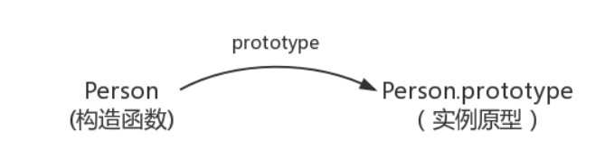
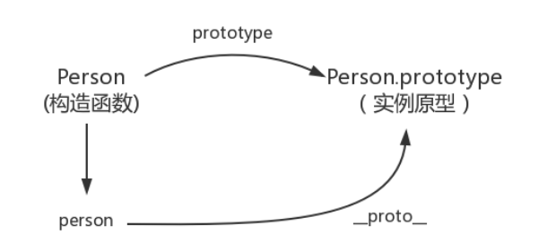
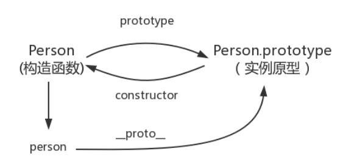
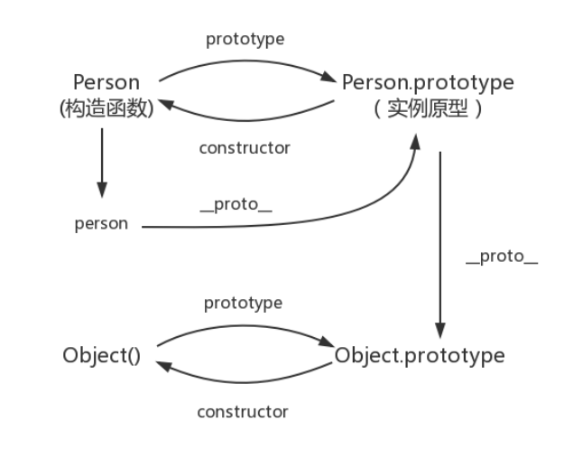
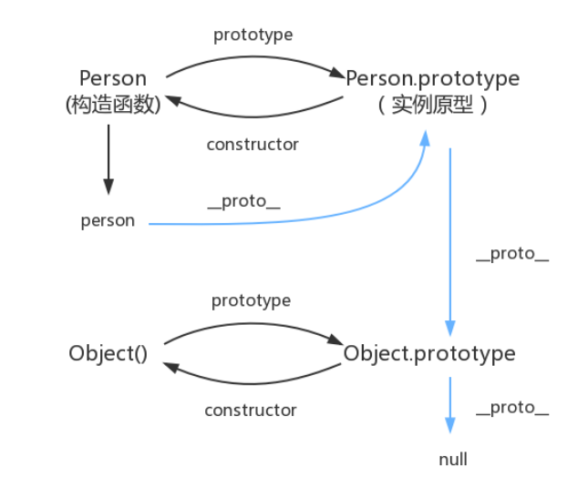

## 构造函数创建对象

先使用构造函数创建一个对象

```javascript
function Person(){

} // 函数对象，函数也是对象
var person = new Person();
person.name = 'Kevin';
console.log(person.name) // Kevin
```

这个例子，Person就是一个构造函数，跟Java语言差不多，我们也可以使用`new`创建一个实例对象`person`


进入正题：

## prototype

每个函数都有一个属于自己的 ***prototype*** 属性，就是我们经常在各种例子中看到的那个  ***prototype*** ，比如：

```javascript
function Person(){

}
// 虽然写在注释里，但是你要注意：
// prototype是函数才会有的属性
Person.prototype.name = 'Kevin';
var person1 = new Person();
var person2 = new Person();
console.log(person1.name) // Kevin
console.log(person2.name) // Kevin
```

**那这个函数的  *prototype* 属性到底指向的是什么呢？是这个函数的原型吗？**

其实，函数的 ***prototype*** 属性指向了一个对象，这个对象正是调用该构造函数而创建的**实例**的原型，也就是这个例子中的 `person1`和`person2`的原型。

**什么是原型？**

举个例子理解：**每一个JavaScript对象(null除外)在创建的时候就会与之关联另一个对象**，<span id="prototpye">这个对象就是平常所说的**原型**</span>，每一个对象都会从原型“继承”属性。

用一张图表示构造函数和实例原型之间的关系： 



在这张图中我们用`Object.prototype`表示实例模型。

**那么我们该怎么表示实例(`person`)与实例原型(`Person.prototype`)之间的关系呢？**这时候需要讲到第二个属性：

## \_\_proto\_\_

这是每一个JavaScript对象(除了bull)都具有的一个属性，叫\_\_proto\_\_ ，这个属性会指向该对象的原型。

为了证明，可以敲以下代码：

```javascript
function Person(){

}
var person1 = new Person();
console.log(person1.__proto__ === Person.prototype) // true
```

可以从`console.log()`输出的结果得出`person1.__proto__`和`Person.prototype`都指向实例原型，于是我们更新下关系图：

既然实例对象`person`和构造函数`Person`都可以指向原型，**那么原型是否有属性指向构造函数或者实例呢？**引入***constructor***。

### 补充

绝大部分浏览器都支持这个非标准的方法访问原型，然而它并不存在于`Person.prototype`中，实际上，它是来自于`Object.prototype`，与其说是一个属性，不如说是一个getter/setter，当使用`obj.__proto__`时，可以理解成返回了`Object.getPrototypeOf(obj)`，

## constructor

原型并没有指向实例，因为一个构造函数可以生成多个实例，但是原型有指向构造函数，也就是第三个属性： ***constructor***，每个原型都有一个***constructor*** 属性指向关联的构造函数。

为了证明，可以敲以下代码：

```javascript
function Person(){

}
console.log(Person.prototype.constructor === Person); //true
```

这样再更新下关系图：



综上我们已经得出：

```javascript
function Person(){

}
var person = new Person();
console.log(person1.__proto__ === Person.prototype) // true
console.log(Person.prototype.constructor === Person); //true
// 顺序学习一个 ES5 的方法，Object.getPrototypeOf可以获得对象的原型
console.log(Object.getPrototypeOf(person) === Person.prototype) // true

```

以上是构造函数、实例原型和实例之间的关系，接下来学习一下实例和原型的关系：

### 补充

通过代码来看个例子：

```javascript
function Person(){

}
var person = new Person();
console.log(person.constructor === Person); //
console.log(person.constructor) // function Person(){   }
```

当读取`person.constructor`时，其实`person`中并没有`constructor`属性，当不能读取到`constructor`属性时，会从`person`的原型也就是`Person.prototype`中读取，正好原型中有该属性，所以：

```javascript
function Person(){

}
var person = new Person();
console.log(person.constructor === Person.prototype.constructor)
```

## 实例与原型

当读取实例的属性时，如果找不到，就会查找与对象关联的原型中的属性，如果还查不到，就去找原型的原型，一直找到最顶层为止。

敲下代码来举例子：

```javascript
function Person(){

}
Person.prototype.name = '缪克立';

var person = new Person();

person.name = '缪立克';
console.log(person.name) // 缪立克

delete person.name;
console.log(person.name) // 缪克立
```

在这个例子中，我们给实例对象person添加了 `name`属性，紧接着打印`person.name`的时候，结果就自然为 `缪立克`。

但是当使用`delete`删除`person`的`name`属性时，读取`person.name`，从`person`对象中找不到`name`属性就会从`person`的原型也就是`person.__proto__`，也就是`Person.prototype`中查找，然后从原型中找到了`name`属性，结果为`缪克立`。

**但是万一还没有找到呢？那么<font color=Red>*原型的原型*</font>又是什么？**

## 原型的原型

[在前面](#prototpye)，我们已经讲了原型也是一个对象，既然是对象，那就可以用最原始的方式创建它，也就是如下代码：

```javascript
var obj = new Object();
obj.name = '缪克立'
console.log(obj.name) // 缪克立
```

其实原型对象就是通过Object构造函数生成的，结合之前所讲，实例的`__proto__`指向构造函数的`prototype`，所以我们再更新下关系图：



> 参考《JavaScript高级程序设计》8.3.1中一段话：
>
> > 构造函数、原型和实例的关系：每个构造函数都有一个原型对象，原型有一个属性`constructor`指回构造函数，而实例有一个内部指针`__proto__`指向原型。**如果原型是另一个类型的实例呢**？那就意味着这个原型本身有一个内部指针指向另一个原型，相应地另一个原型也有一个指针指向另一个构造函数。这样就在实例和原型之间构造了一条原型链。这就是原型链的基本构想。

从以上书中的描述可以明白**原型是另一个类型的实例**，也就是说**原型通过`__proto__`指向自己的原型**，所以关系图上的箭头`__proto__`。

## 原型链

那 `Object.prototype`的原型呢？

`null`，我们可以打印：

```javascript
console.log(Object.prototype.__proto__ === null) // true
console.log(Object.prototype.__proto__) // null
```

然而`null`究竟代表了什么呢？

> 引用阮一峰老师的[undefined与null的区别 - 阮一峰的网络日志 (ruanyifeng.com)](http://www.ruanyifeng.com/blog/2014/03/undefined-vs-null.html)
>
> > null 表示“没有对象”，即该处不应该有值。
> >
> > 1. 作为函数的参数，表示该函数的参数不是对象。
> > 2. 作为对象原型链的重点。

所以`Object.prototype.__proto__`的值为`null`跟`Object.prototype`没有原型，其实表达了一个意思。

所以查找属性的时候查到`Object.prototype`就可以停止查找了。

最后一张关系图也可以更新为：

最后，图中由相互关联的原型组成的链状结构就是<font color=red>**原型链**</font>，也就是<font color=blue>蓝色</font>的这条线。


### 真的是继承吗？

最后是关于继承，前面我们讲到“每一个对象都会从原型‘’继承‘属性”，实际上，继承是一个十分具有迷惑性的说法，引用《你不知道的JavaScript》中的话，就是：

> 继承意味着复制操作，然后JavaScript默认并不会复制对象的属性，相反，JavaScript只是在两个对象之间创建一个关联，这样，一个对象就可以i通过委托访问另一个对象的属性和函数，所以与其叫继承，委婉的说法反而更准确一些。