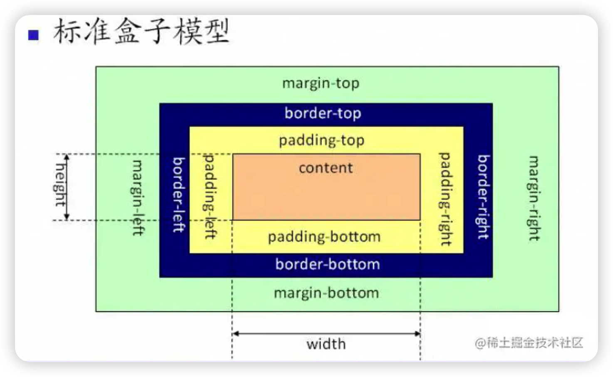
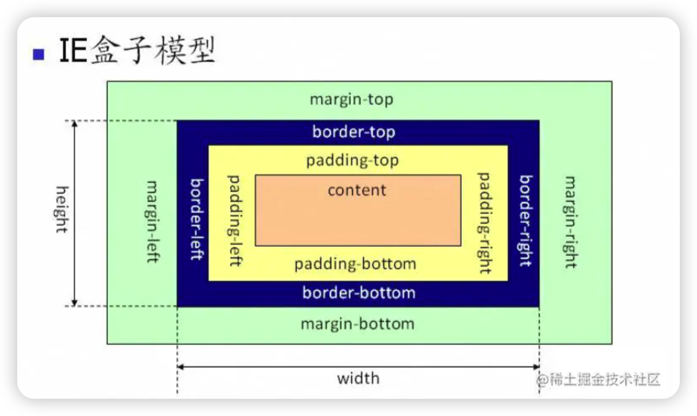

# 前言

本篇文章主要总结一些常见的CSS面试题,会不断更新。

# CSS选择器及其优先级

| **选择器**     | **格式**      | **优先级权重** |
| -------------- | ------------- | -------------- |
| id选择器       | #id           | 100            |
| 类选择器       | #classname    | 10             |
| 属性选择器     | a[ref=“eee”]  | 10             |
| 伪类选择器     | li:last-child | 10             |
| 标签选择器     | div           | 1              |
| 伪元素选择器   | li:after      | 1              |
| 相邻兄弟选择器 | h1+p          | 0              |
| 子选择器       | ul>li         | 0              |
| 后代选择器     | li a          | 0              |
| 通配符选择器   | *             | 0              |

对于选择器的优先级：

- 标签选择器、伪元素选择器：1

- 类选择器、伪类选择器、属性选择器：10

- id选择器：100

- 内联样式：1000（内联样式定义在dom元素的style属性中，格式为：

  ``````html
  <div style="background-color:red;">
    hello
  </div>
  ``````

**注意事项**：

- `!important`声明的样式优先级最高；
- 如果优先级相同，则最后出现的样式生效；
- 继承得到的样式的优先级最低；
- 通用选择器（*）、子选择器（>）和相邻同胞选择器（+）并不在这四个等级中，所以它们的权值都为0；
- 样式表的来源不同时，优先级顺序为：内联样式>内部样式>外部样式>浏览器用户自定义样式>浏览器默认样式。*（内部样式：将css代码集中写在HTML文档的`html`头部标签中，并且用`style`标签定义）*

# display的属性值及其作用

| **属性值**   | **作用**                                                   |
| ------------ | ---------------------------------------------------------- |
| none         | 元素不显示，并且会从文档流中移除。                         |
| block        | 块类型。默认宽度为父元素宽度，可设置宽高，换行显示。       |
| inline       | 行内元素类型。默认宽度为内容宽度，不可设置宽高，同行显示。 |
| inline-block | 默认宽度为内容宽度，可以设置宽高，同行显示。               |
| list-item    | 像块类型元素一样显示，并添加样式列表标记。                 |
| table        | 此元素会作为块级表格来显示。                               |
| inherit      | 规定应该从父元素继承display属性的值。                      |

# display的block、inline和inline-block的区别

（1）**block**：会独占一行，多个元素会另起一行，可以设置`width、height、margin和padding`属性。

（2）**inline**：元素不会独占一行，设置`width、height`属性无效。但可以设置水平方向的`margin和padding`属性，不能设置垂直方向的`padding和margin`；

（3）**inline-block**：将对象设置为inline对象，但对象的内容作为`block`对象呈现，之后的内联对象会被排列在同一行内。

对于行内元素和块级元素，其特点如下：

**（1）行内元素**

- 设置宽高无效；
- 可以设置水平方向的`margin`和`padding`属性，不能设置垂直方向的`padding`和`margin`；
- 不会自动换行；

**（2）块级元素**

- 可以设置宽高；
- 设置`margin`和`padding`都有效；
- 可以自动换行；
- 多个块状，默认排列从上到下。

# 隐藏元素的方法有哪些

- **display:none**：渲染树不会包含该渲染对象，因此该元素不会在页面中占据位置，也不会响应绑定的监听事件。
- **visibility:hidden**：元素在页面中仍占据空间，但是不会响应绑定的监听事件。
- **opacity:0**：将元素的透明度设置为0，以此来实现元素的隐藏。元素在页面中仍然占据空间，并且能够响应元素绑定的监听事件。
- **position:absolute**：通过使用绝对定位将元素移除可视区域内，以此来实现元素的隐藏。
- **z-index:负值**：来使其他元素遮盖住该元素，以此来实现隐藏。
- **clip/clip-path**：使用元素裁剪的方法来实现元素的隐藏，这种方法下，元素仍在页面中占据位置，但是不会响应绑定的监听事件。
- **transform:scale(0,0)**：将元素缩放为0，来实现元素的隐藏。这种方法下，元素仍在页面中占据位置，但是不会响应绑定的监听事件。

# display:none与visibility:hidden的区别

这两个属性都是让元素隐藏，不可见。**两者区别如下**：

（1）**在渲染树中**

- `display：none`会让元素完全从渲染树中消失，渲染时不会占据任何空间；
- `visibility:hidden`不会让元素从渲染树中消失，渲染的元素还会占据相同的空间，只是内容不可见。

（2）**是否是继承属性**

- `display:none`是非继承属性，子孙节点会随着父节点从渲染树消失，通过修改子孙节点的属性也无法显示；
- `visibility:hidden`是继承属性，子孙节点消失是由于继承了`hidden`，通过设置`visibility:visible`可以让子孙节点显示；（3）修改常规文档流中元素的`display`通常会造成文档的重排，但是修改`visibility`属性只会造成本元素的重绘；

（4）如果使用读屏器*（屏幕阅读器是“读取文档”（在您的情况下是网页）并以视觉障碍（例如失明）的人可以轻松消费的方式输出的软件）*，设置为`display:none`的内容不会被读取，设置为`visibility:hidden`的内容会被读取。

# 对盒模型的理解





盒模型都是由四个部分组成的，分别是`margin`、`border`、`padding`、`content`。

标准盒模型和IE盒模型的区别在于设置`width`和`height`时，所对应的范围不同：

- 标准盒模型的`width`和`height`属性的范围只包含了`content`，
- IE盒模型的`width`和`height`属性的范围包含了`border`、`padding`、`content`。

可以通过修改元素的`box-sizing`属性来改变元素的盒模型：

- `box-sizing:content-box`表示标准盒模型（<font color="red">默认值</font>）
- `box-sizing:border-box`表示IE盒模型（怪异盒模型）

# CSS3中有哪些新特性

- 新增各种选择器：（:not(.input):所有class不是"input" 的节点）
- 圆角（`border-radius:8px`）
- 所列布局(`multi-column layout`)
- 阴影（`text-shadow和box-shadow`）和反射（`box-reflect`）
- 文字特效（`text-shadow`）
- 文字渲染（`text-decoration`）
- 线性渐变（`gradient`）
- 旋转（`transform`）
- 增加了旋转，缩放，定位，倾斜，动画，多背景

# 单行、多行文本溢出隐藏

- 单行文本溢出

``````css
overflow: hidden;  					//溢出隐藏
text-overflow: ellipsis;			//溢出用省略号表示
white-space: nowrap;					//规定段落中的文本不进行换行
``````

- 多行文本溢出

``````css
overflow: hidden;						//溢出隐藏
text-overflow: ellipsis;			//溢出用省略号表示
display: -webkit-box;					//作为弹性伸缩盒子模型显示
-webkit-box-orient: vertical; //设置伸缩盒子的字元素排列方式：从上到下垂直排列
-webkit-line-clamp:3;					//设置的行数
``````

webkit-line-clamp用来限制在一个块元素显示的文本的行数。 为了实现该效果，它需要组合其他的WebKit属性。常见结合属性：
display: -webkit-box; 必须结合的属性 ，将对象作为弹性伸缩盒子模型显示 。
-webkit-box-orient 必须结合的属性 ，设置或检索伸缩盒对象的子元素的排列方式 。
text-overflow: ellipsis;，可以用来多行文本的情况下，用省略号“…”隐藏超出范围的文本。
注意：由于上面的三个属性都是CSS3的属性，没有浏览器可以兼容，所以要在前面加一个`-webkit-`来兼容一部分浏览器。

> [单行、多行文本溢出详解博客](https://blog.csdn.net/weixin_52834435/article/details/122515850)

# 两栏布局的实现

一般两栏布局指的是**左边一栏宽度固定，右边一栏宽度自适应**，两栏布局的具体实现：

- 利用浮动，将左边元素宽度设置为200px，并且设置向左浮动。将右边元素的`margin-left`设置为200px，宽度设置为`auto`（默认为`auto`，撑满整个父元素）。

  ``````css
  .outer {
    height: 200px;
  }
  .left {
    float: left;
    width: 150px;
    background: tomato;
  }
  .right {
    margin-left: 200px;
    width: auto;
    background: gold;
    height: 50px
  }
  ``````

  `float`使左边的元素脱离文档流，右边的元素可以和左边的元素显示在同一行，设置`margin-left`让右边的元素不覆盖掉左边的元素，将其挤到右边去

- 利用浮动，左侧元素设置固定大小，并左浮动，右侧元素设置`overflow:hidden`，这样右边就触发了BFC,BFC的区域不会与浮动元素发生重叠，所以两侧就不会发生重叠。

  ``````css
  <style>
    * {
      margin: 0;
      padding: 0;
    }
    .aside {
      float: left;
      width: 200px;
      background-color: pink;
    }
    .main {
      /* 开启BFC，清除左侧浮动的影响 */
      overflow: hidden;
      /* 这里不设置宽度也可以 */
      width: auto;
      /* 
      清除了浮动，会将两个子元素处于同一水平线
      此时不能将宽度设置为100%，会将.main挤压到第二行去 */
      /* width: 100%; */
      min-height: 200px;
      background-color: skyblue;
    }
  </style>
  <body>
      <div class="contain">
          <div class="aside">这是左侧的广告</div>
          <div class="main">这是右侧的内容</div>
      </div>
  </body>
  ``````

- 利用flex布局，将左边元素设置为固定给宽度200px，将右边的元素设置为`flex:1`

  ``````css
  <style>
    * {
      margin: 0;
      padding: 0;
    }
  
    .contain {
      /* 将父容器设置为弹性容器 */
      display: flex;
    }
  
    .aside {
      background-color: pink;
    }
  
    .main {
      /* 内容区会自动放大占满剩余空间 */
      flex: 1;
      min-height: 200px;
      background-color: skyblue;
    }
  </style>
  <body>
    <div class="contain">
      <div class="aside">这是左侧的广告</div>
      <div class="main">这是右侧的内容</div>
    </div>
  </body>
  ``````

- 利用绝对定位，将父级元素设置为相对定位。左边元素设置为absolute定位，并且宽度设置为200px。将右边元素的`margin-left`的值设置为200px。

  ``````css
  .outer {
    position: relative;
    height: 100px;
  }
  .left {
    position: absolute;
    width: 200px;
    height: 100px;
    background: tomato;
  }
  .right {
    margin-left: 200px;
    background: gold;
  }
  ``````

- 利用绝对定位，将父级元素设置为相对定位。左边元素高度设置为200px，右边元素设置为绝对定位，左边定位为200px，其余方向定位为0。

  ``````css
  .outer {
    position: relative;
    height: 100px;
  }
  .left {
    width: 200px;
    background: tomato;
  }
  .right {
    position: absolute;
    top: 0;
    right: 0;
    bottom: 0;
    left: 200px;
    background: gold;
  }
  ``````

  
