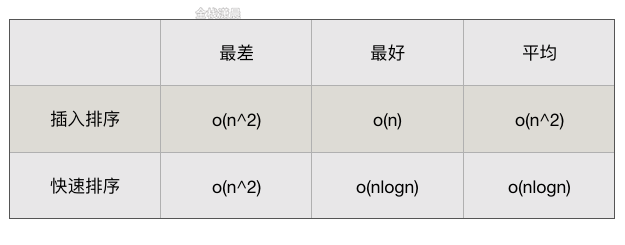
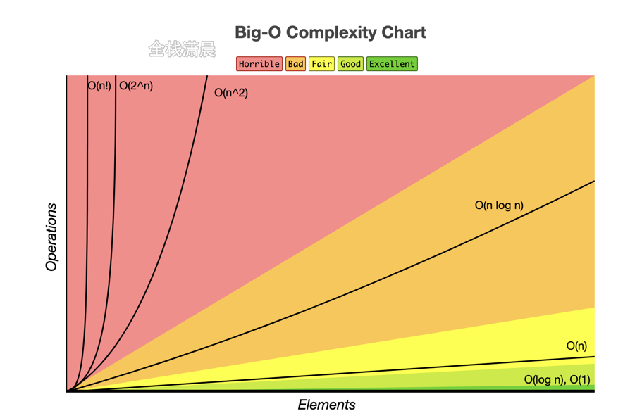
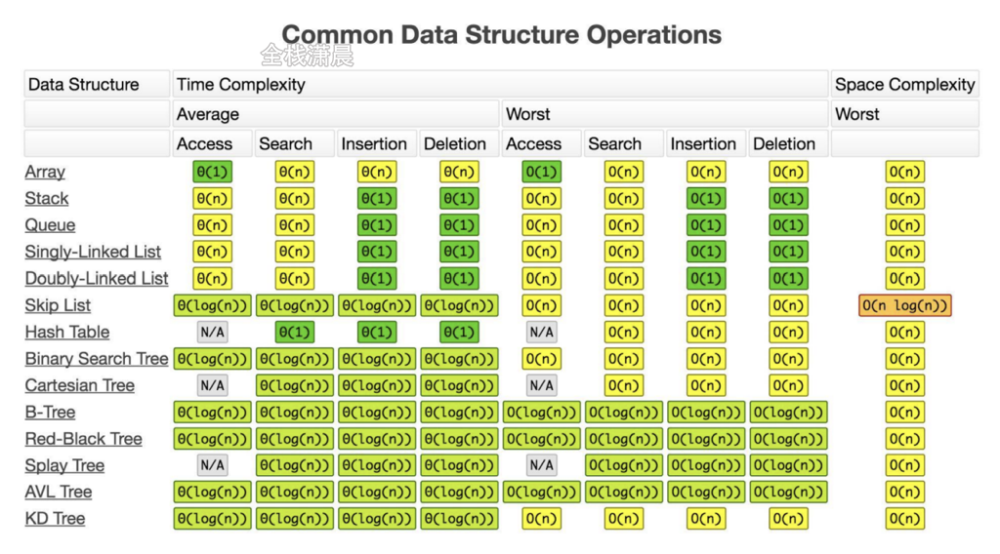
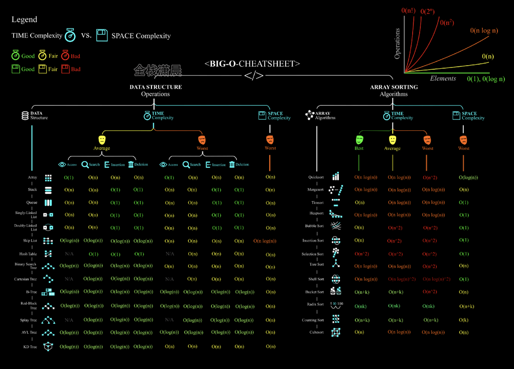

## 什么是时间复杂度

时间复杂度是一个函数，它定性描述该算法的运行时间，在软件开发中，时间复杂度就是用来方便开发者估算出程序运行时间，通常用算法的操作单元数量来代表程序消耗的时间，这里默认CPU的每个单元运行消耗的时间都是相同的。假设算法的问题规模为`n`，那么操作单元数量便用函数`f(n)`来表示，随着数据规模`n`的增大，算法执行时间的增长率和`f(n)`的增长率呈现一定的关系，这称作为算法的渐近时间复杂度，简称时间复杂度，记为 `O(f(n)`)，其中n指的是指令集的数目。


## 什么是大O

**大O用来表示算法执行时间的上界**，也可以理解为最差情况下运行的时间，数据量和顺序等情况对算法的执行时间有非常大的影响，这里假设的是某个输入数据用该算法运行的时间，比其他数据的运算时间都要长。

插入排序的时间复杂度我们都说是`O(n^2)` ，但是插入排序的时间复杂度和输入数据有很大的关系，假如输入数据是完全有序的，则插入排序的时间复杂度是`O(n)`，假如输入的数据是完全倒序的，则时间复杂度是`O(n^2)`，所以最坏是`O(n^2)` 的时间复杂度，我们说插入排序的时间复杂度为`O(n^2)`。

快速排序是`O(nlogn)`，快速排序的在最差的情况下时间复杂度是`O(n^2)` ，一般情况下是`O(nlogn)`，**所以严格从大O的定义来讲，快速排序的时间复杂度应该是O(n^2)**，但是我们依然说快速排序的时间复杂度是`O(nlogn)`，这是业内默认的规定。

二分查找的时间复杂度是`O(logn)`，每次二分数据规模减半，直到数据规模减少为 1，最后相当于求2的多少次方等于n，相当于分割了`logn`次。

归并排序的时间复杂度是`O(nlogn)`，自顶而下的归并，从数据规模为n分割到1，时间复杂度是O(logn)，然后不断向上归并的时间复杂度是`O(n)`，总体时间复杂度是`O(nlogn)`。

树的遍历复杂度一般是`O(n)`，`n`是树的节点个数，选择排序时间复杂度是`O(n^2)`，我们会在对应的章节逐步分析各个数据结构和算法的复杂度。更多的时间复杂度分析和推导可参阅主定理。

## 分析复杂度的一些规则

- 多个时间复杂度相加，如果都是与n相关，则取取复杂度高的那一个，例如：O(nlogn + n) = O(nlogn)，O(nlogn + n^2) = O(n^2)。
- 多个时间复杂度相加，如果其中有些项的复杂度和n不相关则不能忽略任何项，例如：O(AlogA + B)，O(AlogA + B^2)
- 两个循环依次执行，则取复杂度高的那个，嵌套多个循环则需要累乘复杂度。

## 常见时间复杂度

- O(1):常数复杂度

  ```js
  let n = 100;
  ```

- O(logn):对数复杂度

  ```js
  //二分查找非递归
  var search = function (nums, target) {
    let left = 0,
      right = nums.length - 1;
    while (left <= right) {
      let mid = Math.floor((left + right) / 2);
      if (nums[mid] === target) {
        return mid;
      } else if (target < nums[mid]) {
        right = mid - 1;
      } else {
        left = mid + 1;
      }
    }
    return -1;
  };
  ```

- O(n):线性时间复杂度

  ```js
  for (let i = 1; i <= n; i++) {
    console.log(i);
  }
  ```

  i变量从1到n，循环了n次，每次里面的时间复杂度是常数时间复杂度O(1)，所以时间复杂度是O(n)

- O(n^2)：平方

  ```js
  for (let i = 1; i <= n; i++) {
    for (let j = 1; j <= n; j++) {
      console.log(i);
    }
  } //里面一层n次，外面一层n次
    
  for (let i = 1; i <= n; i++) {
    for (let j = 1; j <= 30; j++) { //嵌套的第二层如果和n无关则不是O(n^2)
      console.log(i);
    }
  } //里面这一层从1到30，和n无关，所以时间复杂度是O(n)
  ```

- O(2^n)：指数复杂度

  ```js
  for (let i = 1; i <= Math.pow(2, n); i++) {
    console.log(i);
  }
  ```

- O(n!)：阶乘

  ```js
  for (let i = 1; i <= factorial(n); i++) {
    console.log(i);
  }
  ```



 反应了n的规模一直变大，各个时间复杂度的大小关系，其中最小的就是常数时间复杂度，然后是对数时间复杂度，然后是线性时间复杂度

## 常见数据结构基础操作的时间复杂度





## 递归的时间复杂度

递归的时间复杂度和递归的深度有关

```js
//递归了n层 时间复杂度O(n)
function sum2(n) {
  if (n === 0) {
    return 0;
  }
  return n + sum2(n - 1);
}
```

```js
//二分查找 递归了logn层 O(logn)
var search = function (nums, target) {
    return search_interval(nums, target, 0, nums.length - 1)
};

function search_interval(nums, target, left, right) {
    if (left > right) {
        return -1
    }
    let mid = left + Math.floor((right - left) / 2);
    if (nums[mid] === target) {//判断目标值和中间元素的大小
        return mid
    } else if (nums[mid] < target) {//递归寻找目标元素
        return search_interval(nums, target, mid + 1, right)
    } else {
        return search_interval(nums, target, left, mid - 1)
    }
}
```

```js
//斐波那契数：递归法求斐波那契数，总共递归了n层，二叉树的高度是n，由我们的基础知识可以知道，
//一个高度为n的二叉树最多可以有 2^n - 1 个节点，也就是递归过程函数调用的次数，所以时间复杂度为 O(2^n)。
//有多少个结点就相当于进行了多少次递归
//我们可以看到递归树中包涵非常多的重复计算。
//0, 1，1，2，3 ...
var fib = function (N) {
  if (N == 0) return 0;
  if (N == 1) return 1;
  return fib(N - 1) + fib(N - 2);
};
```


## 时间复杂度优化

- 采用更好的算法：举例：1+2+3...n从`1～n`求和，直接循环法，for i->n: sum+=i ，我们也可以用求和公式: `n(n+1)/2`。在比如有些问题可以用二分查找等。
- 空间换时间，时间是宝贵的，我们计算一个非常耗时的任务，可能要等上很久，突然的断电，或者意外情况可能会导致非常大的损失，空间是廉价的，最多我们购买更大内存的服务器，花钱就可以解决，在后面的章节有非常多的这样的例子，比如用`set`或`map`加快查找的速度，用二叉搜索树或者字典树加快字符串的搜索。

#### 一个时间复杂度分析的例子

有一个字符串数组，将数组中的每个字符串按照字母排序，然后在将整个字符串数组按照字典顺序排序。求整个操作的时间复杂度。

假如我说时间复杂度是`O(n*nlogn + nlogn) = O(n^2logn)` 对吗，花时间思考一下。

我们来分析一下，假设最长字符串的长度是s，数组中有n个字符串，对每个字符串排序 `O(slogs)`，将数组中的每个字符串按照字母排序`O(n * slogs)`，将整个字符串数组按字典排序 `O(s * nlogn)`，所以最后的时间复杂度是`O(n * slogs) + O(s * nlogn) = O(nslogs + nslogn) = O(ns * (logs+logn))`


## 空间复杂度

空间复杂度指的是算法在运行过程中所占存储空间的大小，空间复杂度(Space Complexity)记作`S(n)` ，依然使用大O来表示。利用程序的空间复杂度，可以对程序运行中需要多少内存有个预先估计。

#### 常见的空间复杂度

- 一维数组空间，如果存储了n个元素，空间复杂度`O(n)`
- 二维数组空间，总共有n个数组，每个数组存储了n个元素，空间复杂度`O(n^2)`
- 常数空间复杂度`O(1)`

#### 递归的空间复杂度

```js
//O(1)
function sum1(n) {
  let ret = 0;
  for (let i = 0; i <= n; i++) {
    ret += i;
  }
  return ret;
}

//O(n)，递归了n层，递归栈空间是O(n)的复杂度
function sum2(n) {
  if (n === 0) {
    return 0;
  }
  return n + sum2(n - 1);
}

//O(logn)，递归了logn层，递归栈空间是O(logn)的复杂度
var search = function (nums, target) {
    return search_interval(nums, target, 0, nums.length - 1)
};

function search_interval(nums, target, left, right) {
    if (left > right) {
        return -1
    }
    let mid = left + Math.floor((right - left) / 2);
    if (nums[mid] === target) {//判断目标值和中间元素的大小
        return mid
    } else if (nums[mid] < target) {//递归寻找目标元素
        return search_interval(nums, target, mid + 1, right)
    } else {
        return search_interval(nums, target, left, mid - 1)
    }
}
```


## 致谢

本文参考[全栈潇晨](https://xiaochen1024.com/series/6196129fc1553b002e57bef5/619621d3c1553b002e57bef8)博客所写，放在本博客只是为了供个人学习参考，如有侵权博主会立即删除。